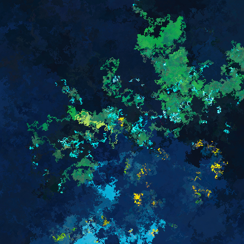

## Image rewalk, `rewalk`

An algorithm that transforms an input image using random walks.

The following images are all generated with the default Windows XP background (by Charles O'Rear) as the source image.

  


## Compilation

The project is meant to be built with `SDL3` and `SDL3_image`. Assuming these are locally installed, and accessible with `-l`, the main file is compiled with:
```sh
gcc -Wall -o rewalk -lSDL3 -lSDL3_image rewalk.c
```

## Usage

Run `./rewalk` to get the following help message:
```
DESCRIPTION:
    Transform an input image into another using random walks
USAGE:
    rewalker [options...] <path_to_img>
OPTIONS:
    --output=...     (string)     Sets the output path for the generated image
    --width=...      (int)        The width of the generated image in px. Default is 600px
    --height=...     (int)        The height of the generated image in px. Default is 600px
    --tiled                       Attempts to generate an image that tiles on both axes
    --preview                     Opens a window to preview generated images, and generate more
EXAMPLE:
    rewalker --width=1920 --height=1080 --output=wallpaper.png source.png
```

## Notes

This was inspired by the Rainbow Smoke algorithm, as showcased in [this video](https://www.youtube.com/watch?v=dVQDYne8Bkc) by Generative Garden. But my version does not ensure all pixels from the source image are all used. Feel free to contribute!

### More showcase

 

 

 


 
